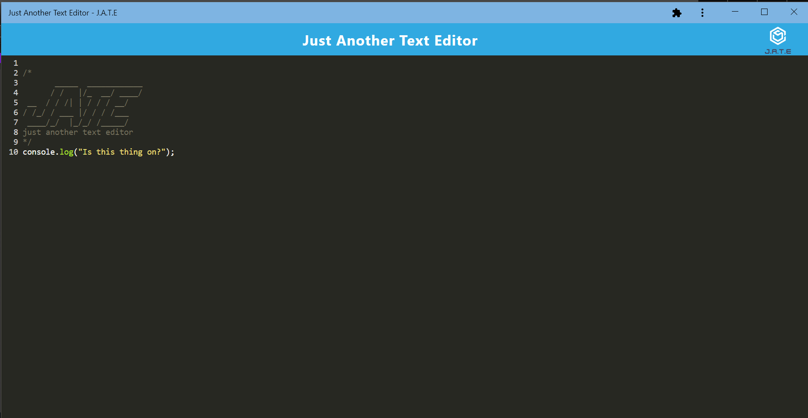

# <h1 align="center">PWA_text-editor  </h1>

## Technologies 🤖

## Description
A single page text editor that runs in the browser and meets PWA criteria. The app is installable and functions offline

Deployed to Heroku <a href="https://evening-inlet-50387.herokuapp.com/">here!</a>

## Installation

* Run `npm init -y` from the command line
* Run `npm i` to install dependencies
* Makes sure dependencies from all three package.json's are installed

## Usage

* Run `npm start` in the root directory from the command line

### Made with ❤️ by  Brad Dunham

Back to [top of page](# )

